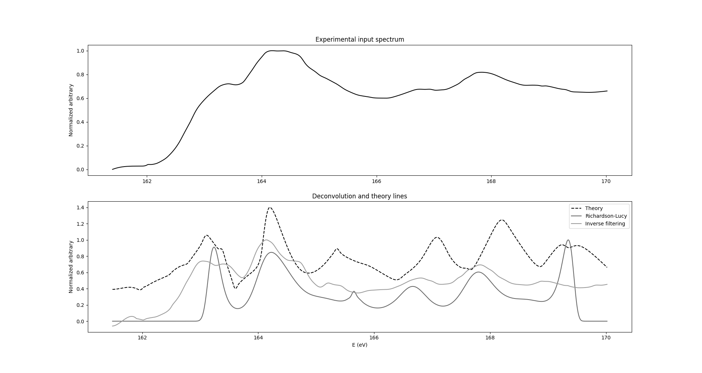
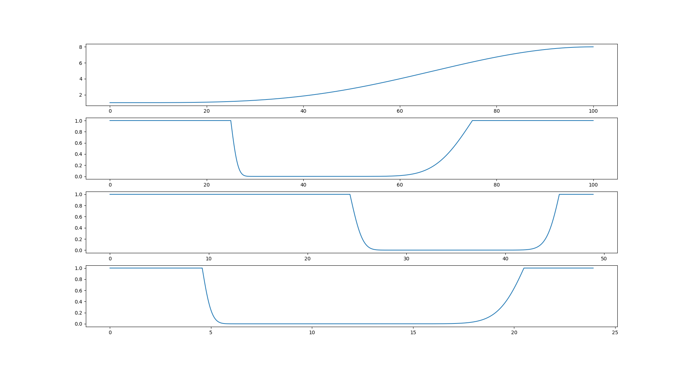

# A few notes on deconvolution of XAFS spectra

Daniel Correia

> An ostensibly more noise-tolerant deconvolution algorithm is (poorly) implemented in Larch; results are not clearly superior. Real-world results from the VLS-PGM are re-processed and yield useable fidelity. An interface to the existing inverse filtering deconvolution is added to demeter/Athena. Non-stationary kernels are discussed.

@Highresolution2007 perform XANES on a variety of ZnS sphalerite samples and compare FLY to a nifty ab initio model. They find limited correspondence between theory and experiment unless the predicted spectra are filtered and broadened by 1 eV, accounting for all the sources of line uncertainty in the experiment, in which case a perfect fit is found.

In this figure, two deconvolution algorithms (bottom, solid) are used to pare off a gaussian with $\pm\sigma=0.5 \text{ eV}$ from the same experimental data (top), the reverse procedure to that used in Pratt et al.

Very surprisingly, the small inflection point near 166 eV (what is this feature?) predicted by theory is accurately reconstructed by the L-R algorithm, even though no corresponding feature is obviously present in the input data. On the other hand, a poor showing is consistenly seen in the ripple near 170 eV.

A relatively wide slit width of 100 um was used for this experiment, which may have contributed to the success of deconvolution.

### Introduction

*(note: this was written by someone with perhaps an hour's experience in XAS, as a learning experience; all statements are almost certainly false.)*

Notes and code from this paper are available at 
https://github.com/0xDBFB7/synchrotron-project; 
Forks of larch [@Larch2013] and demeter[@ATHENA2005] used are 
https://github.com/0xDBFB7/xraylarch and
https://github.com/0xDBFB7/demeter.

In papers characterizing the VLS-PGM[@zuin2007early][@VLSPGM2007a] and similar beamlines, the resolving power $\lambda/\text{d}\lambda = E/\text{d}E$ of the system is often a key point of comparison. However, this resolving power does not perhaps seem to represent an ultimate "information-theoretic" limit, but rather seems to mostly reflect the fineness of the output spectrum of the monochromator [see, @XRay1991, chapter 9.5, "Plane crystal spectrograph"].

Purely for amusement, the question arose of what ultimate resolution could be achieved if the effect of the monochromator spectrum was corrected for. 

With modern detectors and techniques, I assume that circumstances where deconvolution is part of a good experimental design are probably rather rare. @High2021, for instance, discuss a HERFD-XAS technique that can natively probe at sub-linewidth resolutions. It seems better to use an inherently higher-resolution technique then to try to extract ambiguous peaks from mud. The L-R algorithm has several knobs that can be turned to suit different hypotheses [@Retraction2018]; if careful attention is not taken in following the strict validation procedures listed [@Deconvolving2007] (as was neglected here) many conclusions could be argued for using the same data.

An X-ray spectrum observed from experiment represents the convolution of many different sources of broadening. Excellent discussion can be found in [@XRay1991], particularly chapters 4.4, 4.5.3 and 4.7, and the larch manual page [@13a] on deconvolution. Sources of experimental error are listed by @Curve1988, and include an $I$ term for beam intensity, an $M_i$ term for monochromator first and higher orders, a $D$ term for detector transfer functions, and finally various sample contamination terms $S_e$.

The most severe in cases of high medium Z is lifetime broadening, a consequence of the uncertainty principle. This goes as

$$\Gamma\approx A + RZ^4$$ 

The next most significant contribution is experimental. There are many ways of correcting for instruments [@Curve1988]; division by reference lines, subtraction, etc.

Since the resolving power of the monochromator can be simulated, there is considerable information available for deconvolution. A very analogous procedure is performed with some high-performance digitizers [@Bandwidth1994] in the time domain rather than the energy domain.

### Deconvolution algorithms

Larch has a built-in support for deconvolution using numpy's 'deconvolve', and can deconvolve a gaussian or laplacian kernel. This performs a very basic fourier-transform Inverse Filtering deconvolution with a final Golay filtering step. In general, inverse filtering is held to perform poorly in the presence of noise and imperfect knowledge.

Advanced techniques exist [@Extraction2000]; these seemed daunting for the time allotted.

[@Deconvolving2007] use an algorithm based on the Lucy-Richardson, an iterative method, with a gaussian smoothing step to suppress noise. I had not anticipated the success of IF. This is the L-R algorithm used in the plot above. 

One advantage of the L-R method is that it only requires the forward convolution to exist, which allows a bit more flexibility. The convergence properties seen in my implementation is not similar to that by Fister et al, so there are almost certainly lingering bugs.

### Non-stationary kernels

One impediement to deconvolving to the maximum resolution, especially in the case of the VLS-PGM, is the significant non-flatness of the monochromator's output spectrum across the energy window.

In the worst-case, the resolving power can vary between 27000 to 15000 between 10 and 20 eV.

In practice, segments of spectrum requiring ultra-high-resolution seem probably unlikely to be very much wider than a few tens of eV, so the variation in spectrum seems likely to be small. 

In signal theory this property is known as a non-stationary or varying kernel or PSF. An interesting technique using eigen-kernel decomposition, suitable for deconvolving energy-variant kernels of arbitrary (non-guassian structure), is listed in [@Deconvolution2002].

Another technique - only valid for gaussian kernels - is to stretch and warp the energy domain to create a uniform broadening, like so:

